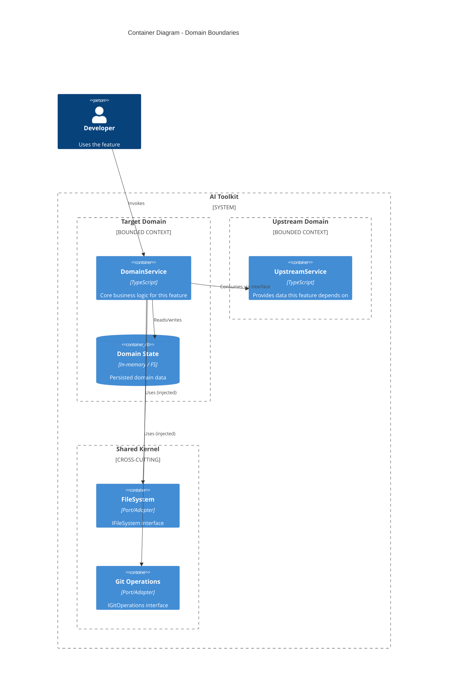
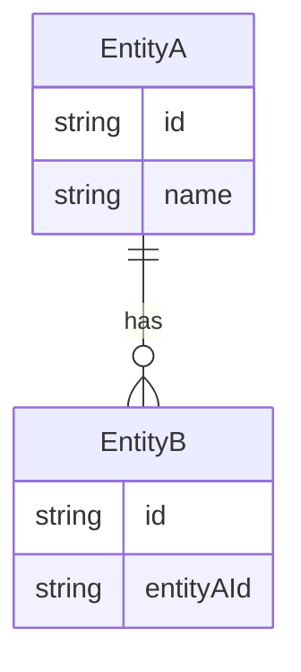
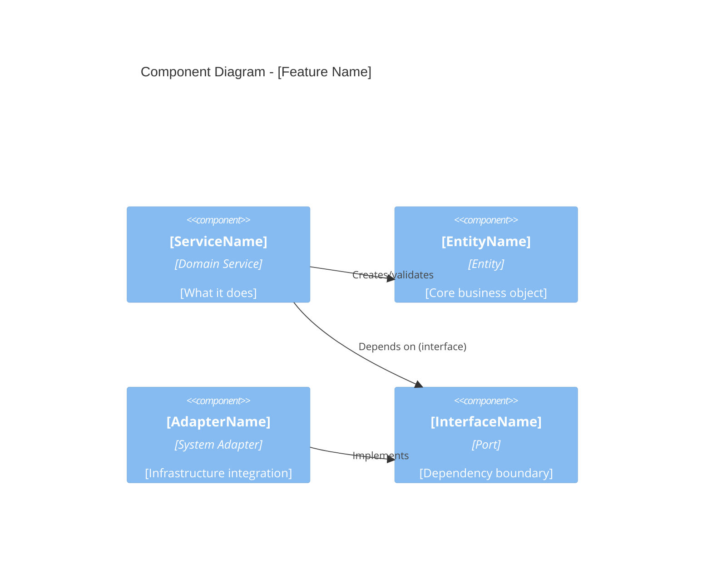

# Product Requirements Document: [Product Name]

## Background

### Problem Statement

[Describe the core problem this feature solves. Support with data where possible.
Must be at least 100 characters of substantive content.
Example: "Engineers spend 30+ minutes per PR manually checking for secrets,
supply chain issues, and compliance violations. This manual process is
error-prone and blocks PR velocity."]

### Market Opportunity

[Describe market trends, competitor landscape, and how this solution
differentiates. Remove this section if building an internal tool.]

### User Personas

[Define target users, their needs, and how this feature helps them.
Example: "Senior Developer - needs fast feedback on security issues
without leaving their editor. Currently relies on CI pipeline results
which arrive 5-10 minutes after push."]

### Vision Statement

[One-paragraph vision for what this feature enables.
Example: "Enable developers to catch 95% of security and compliance
issues before they leave the local machine, reducing PR review cycles
from 3 rounds to 1."]

### System Context & Stakeholders

[Where does this feature fit in the system? Who interacts with it?]

## Objectives

### Risk Mitigation

[Identify risks and mitigation strategies.
Example: "Risk: False positives cause alert fatigue.
Mitigation: Tunable sensitivity levels with per-project overrides."]

## Core Features (Must Have)

[List features using ### Feature N: Title format. The planner extracts
tasks from this pattern.]

### Feature 1: [Feature Name]

**Description:** [What this feature does and why it matters]

**Acceptance Criteria:**

- Given [precondition], when [action], then [expected result]
- Given [precondition], when [action], then [expected result]

### Feature 2: [Feature Name]

**Description:** [What this feature does and why it matters]

**Acceptance Criteria:**

- Given [precondition], when [action], then [expected result]
- Given [precondition], when [action], then [expected result]

## Should Have Features

[Features that add value but are not critical for initial release.]

### Feature 3: [Feature Name]

**Description:** [What this feature does]

**Acceptance Criteria:**

- Given [precondition], when [action], then [expected result]

## Architecture & Design

This project follows Clean Architecture with Domain-Driven Design (DDD).
Business logic is independent of infrastructure. Dependencies point inward.
See docs/guides/agents.clean.arch.md for the full guide.

### Domain Model

[Which bounded context does this belong to? What are the core entities?
Refer to docs/domains.md or docs/ARCHITECTURE.md if found, for existing bounded contexts.
New features should fit into an existing bounded context or justify a new one.]

- **Bounded Context**: [e.g., Security / Secrets]
- **Core Entities**: [e.g., SecretFinding, ScanResult -- mutable objects with identity]
- **Value Objects**: [e.g., Severity, FileLocation -- immutable, no identity]
- **Aggregates**: [e.g., ScanReport groups findings -- consistency boundary]
- **Domain Services**: [e.g., SecretScanner -- stateless operations on entities]

#### C4 Container Diagram (Level 2) -- Domain Boundaries

[Show how this feature's bounded context relates to other contexts in the system.
Level 2 reveals the containers (packages, services, stores) inside the system boundary
and how they interact. Replace the example below with actual domains.]



[When filling this in, answer these questions:
- Which existing bounded context does this feature belong to? (see docs/domains.md)
- Does it consume data from another domain? Show the upstream dependency.
- Which shared kernel components does it use? (filesystem, git, logging, etc.)
- Does it expose data to other domains? Show the downstream relationship.]

#### Domain Relationships



### Clean Architecture Layers

Each domain subdomain follows this file structure:

```text
domain/subdomain/
  interfaces.ts       # Ports (IFileSystem, IGitOperations, etc.)
  constants.ts        # Domain constants
  entity.ts           # Core business entities (immutable where possible)
  service.ts          # Services with dependency injection
  *.system.ts         # Infrastructure adapters (excluded from coverage)
  *.test.ts           # Tests (colocated with source)
  index.ts            # Public API (barrel export)
```

Key rules:
- Business logic in `entity.ts` and `service.ts` -- no infrastructure imports
- Infrastructure adapters in `*.system.ts` -- implement interfaces from `interfaces.ts`
- Dependencies injected via constructor parameters, never imported directly
- Tests use in-memory implementations, not mocks

#### C4 Component Diagram

[Replace placeholder entities with actual components for this feature.]



### Interface Boundaries

[Define input/output contracts for the feature. These are the ports
that adapters implement.]

#### Input

```typescript
// What data enters the system
interface FeatureInput {
  // [Define fields]
}
```

#### Output

```typescript
// What data exits the system
interface FeatureOutput {
  // [Define fields]
}
```

#### Error Interface

```typescript
// How errors are communicated
interface FeatureError {
  code: string;
  message: string;
  details?: unknown;
}
```

### External Dependencies

[List all external systems and how they are abstracted behind interfaces.
Never depend on infrastructure directly from business logic.]

| Dependency | Purpose | Port (interface) | Adapter (*.system.ts) |
|-----------|---------|-----------------|----------------------|
| [e.g., File System] | [e.g., Read source files] | [e.g., IFileSystem] | [e.g., NodeFileSystem] |

### Dependency Injection Strategy

- **Production**: Real infrastructure adapters
- **Testing**: In-memory implementations of the same interfaces
- **No mocks**: Use test doubles with controlled behavior, not mock libraries

## Test Strategy

[Must be at least 100 characters. Describe the testing approach for this feature.
This project follows a GAMP5-inspired risk-based test pyramid. Apply the
qualification levels appropriate to the feature's risk classification.]

### Test-Driven Development Approach

Each feature follows RED/GREEN/REFACTOR:

1. **Red**: Write failing test that describes expected behavior
2. **Green**: Write minimal code to pass the test
3. **Refactor**: Improve code while keeping tests green

### Test Pyramid

Tests are organized by qualification level, from fastest/cheapest to
slowest/most expensive. Not every feature requires every level -- apply
based on risk assessment (see Risk Classification below).

| Level | Type | Purpose | Framework | When to apply |
|-------|------|---------|-----------|---------------|
| 1 | **Unit** | Verify individual functions and classes in isolation | bun:test | All features |
| 2 | **SIT** (System Integration) | Verify interactions between modules, services, and adapters | bun:test | Features with cross-module dependencies |
| 3 | **E2E / UAT** | Verify user-facing workflows end-to-end | Playwright | Features with CLI or UI interaction |
| 4 | **IQ** (Installation Qualification) | Verify the system installs correctly in target environments | bun:test + shell | Installer features, MCP configuration, package publishing |
| 5 | **OQ** (Operational Qualification) | Verify the system operates correctly under expected conditions | Playwright + shell | Features affecting deployment, CI/CD, or runtime behavior |
| 6 | **Performance** | Verify response times, throughput, and resource usage under load | k6 / JMeter | Features with performance SLAs or large input sets |
| 7 | **Security** | Verify absence of vulnerabilities (see docs/SECURITY.md) | secureai CLI + SAST | All features handling secrets, auth, PII, or user input |

### Risk Classification (GAMP5-Inspired)

Determine which test levels apply based on the feature's risk:

| Risk level | Impact if broken | Required test levels | Example |
|-----------|-----------------|---------------------|---------|
| **Low** | Cosmetic, non-functional | Unit | Documentation generation, log formatting |
| **Medium** | Degraded functionality, workaround exists | Unit, SIT | PR template generation, coverage reporting |
| **High** | Core functionality broken, no workaround | Unit, SIT, E2E/UAT | Secret detection, supply chain scanning, policy enforcement |
| **Critical** | Security breach, data loss, or compliance violation | Unit, SIT, E2E/UAT, IQ, OQ, Security | Auth flows, PII handling, credential management |

### Unit Tests

| Scenario | Input | Expected Output | Priority |
|----------|-------|-----------------|----------|
| [Happy path] | [Valid input] | [Success result] | High |
| [Edge case] | [Boundary input] | [Handled gracefully] | High |
| [Error case] | [Invalid input] | [Specific error] | Medium |

### IQ Scenarios (if applicable)

[Installation Qualification -- verify the feature installs and configures correctly.]

| Scenario | Verification | Pass criteria |
|----------|-------------|---------------|
| [e.g., Fresh install on macOS] | [e.g., Config file created at expected path] | [e.g., File exists with valid schema] |
| [e.g., Upgrade from previous version] | [e.g., Existing config preserved] | [e.g., No data loss, new fields added] |

### OQ Scenarios (if applicable)

[Operational Qualification -- verify the feature operates correctly under normal conditions.]

| Scenario | Verification | Pass criteria |
|----------|-------------|---------------|
| [e.g., Scan 100-file repo] | [e.g., All findings reported within timeout] | [e.g., Completes in <30s, zero missed findings] |
| [e.g., Run with network offline] | [e.g., Graceful degradation] | [e.g., Cached results used, clear error message] |

### Acceptance Criteria (Testable)

| ID | Criterion | Test Level | Automated |
|----|-----------|-----------|-----------|
| AC1 | Given [X], when [Y], then [Z] | Unit | Yes |
| AC2 | [User can complete workflow] | E2E/UAT | Yes |
| AC3 | [System installs correctly] | IQ | Yes |
| AC4 | [System operates under load] | OQ/Perf | Yes |

### Test Coverage Requirements

- Unit tests: >80% line coverage on business logic
- Excluded from coverage: `**/*.system.ts`, `**/index.ts`
- IQ/OQ tests: required for Critical and High risk features
- Security tests: required for any feature handling secrets, PII, or auth (see docs/SECURITY.md)

## Security Considerations

[What sensitive data does this feature handle? What threats apply?
Refer to docs/SECURITY.md for project security standards and scanning tools.]

| Threat | Risk Level | Mitigation |
|--------|-----------|------------|
| [e.g., Input injection] | [High/Medium/Low] | [e.g., Input validation] |

## Future Enhancements

[Features out of scope for this release but planned for later.]

- [Enhancement 1]: [Brief description]
- [Enhancement 2]: [Brief description]
