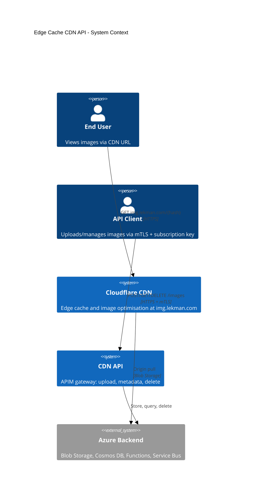
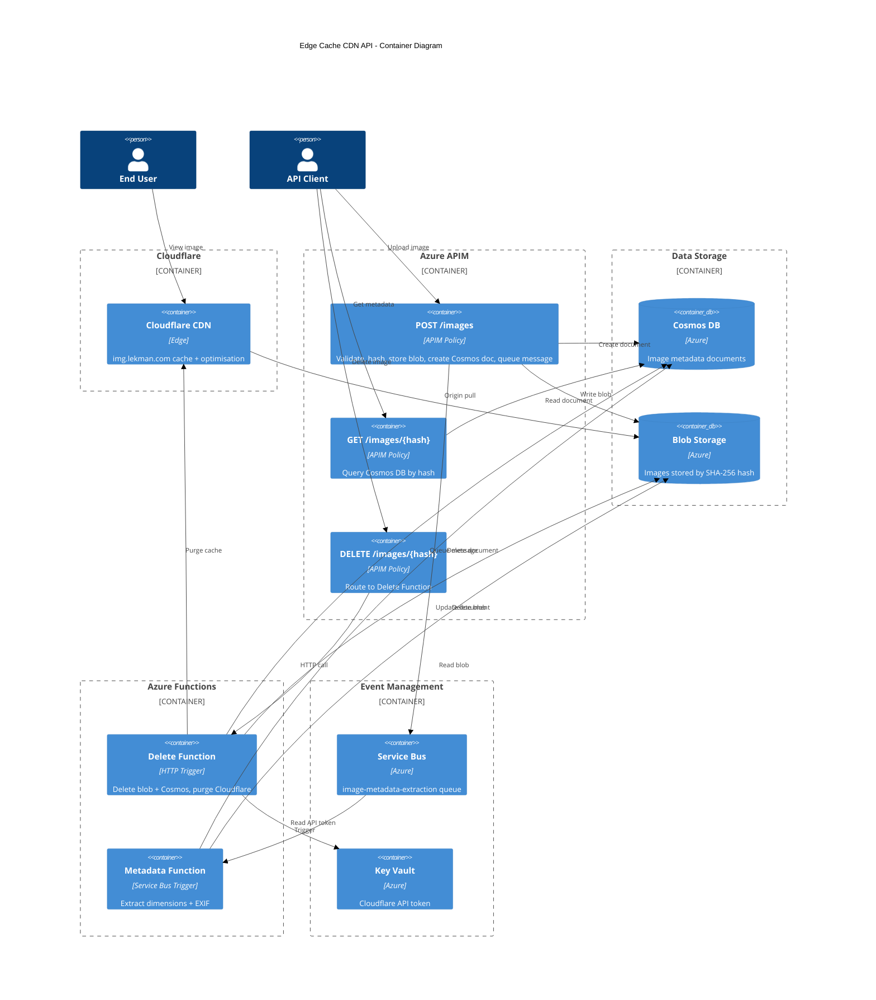
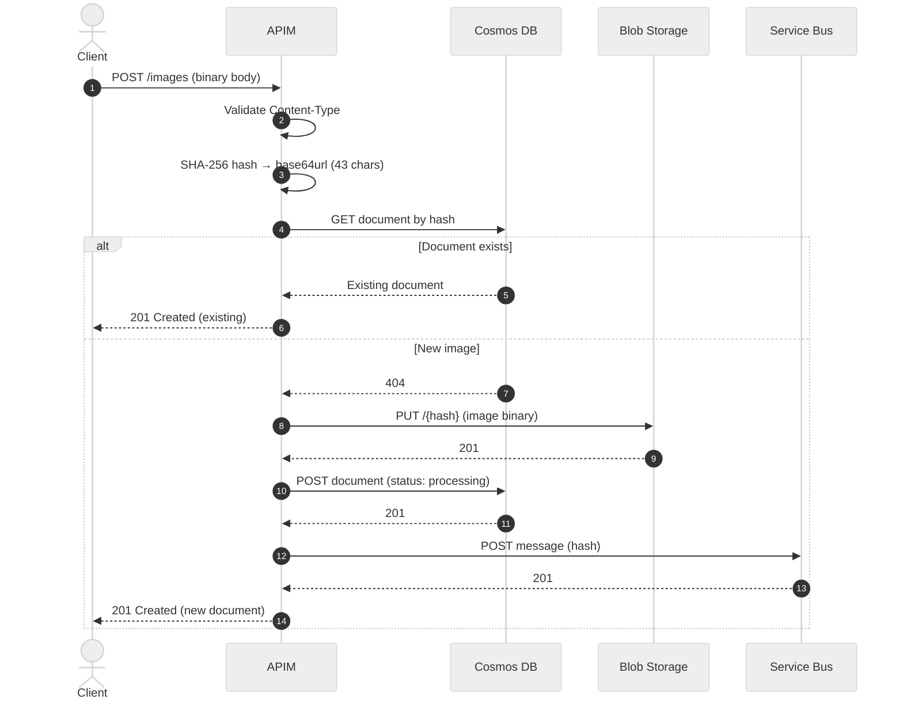
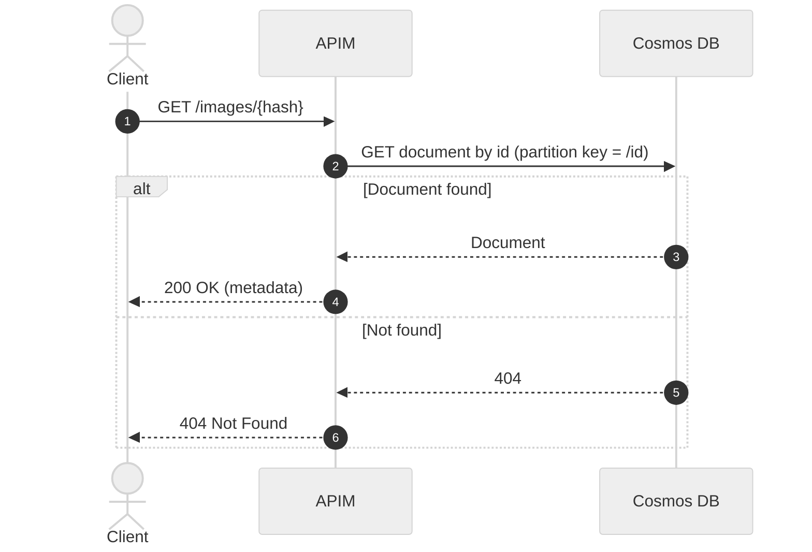
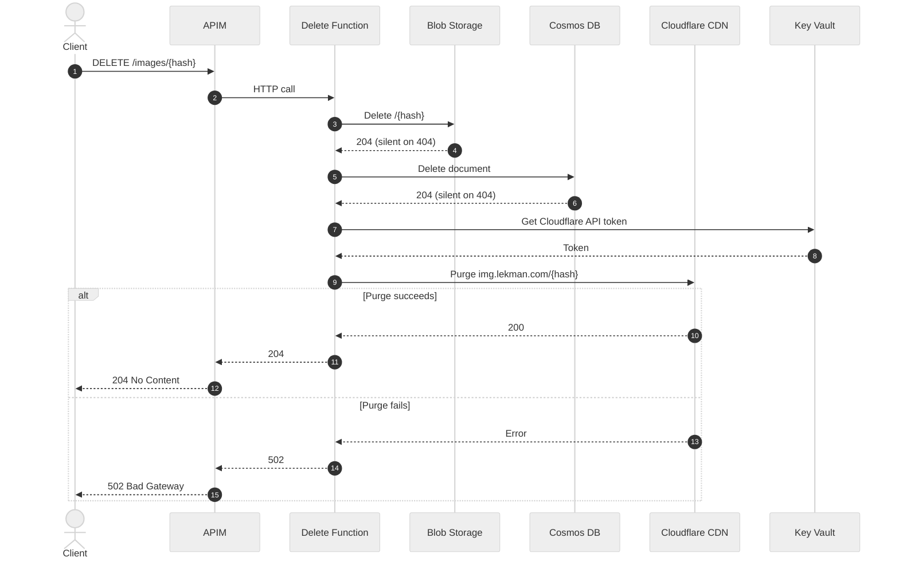
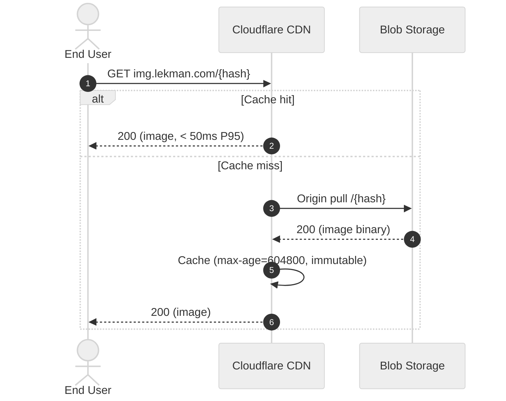
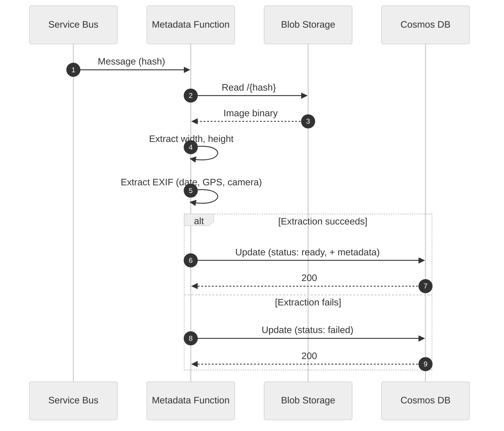

# Architecture

**Audience**: Developers and contributors working on @lekman/cdn.

## System Context (C4 Level 1)

The system context shows how the Edge Cache CDN API fits into a consumer's workflow. Clients upload images via APIM. Images are served from Cloudflare CDN at the edge.

<div style="background: white; background-color: white; padding: 0px; border: 1px solid #ccc; border-radius: 10px; max-width: 700px; margin: 1em auto">



</div>

## Container Diagram (C4 Level 2)

Zooms into the system boundary to show each deployable unit and how they communicate. APIM handles all three API operations through XML policies with direct backend calls (no application code). Azure Functions handle the two async/complex operations: delete (which requires three coordinated deletes plus a Cloudflare purge) and metadata extraction (triggered by Service Bus).

<div style="background: white; background-color: white; padding: 0px; border: 1px solid #ccc; border-radius: 10px;">

<!-- [MermaidChart: c7dc0071-0ea9-4f28-847e-f4f29a34617d] -->


</div>

## Component Overview

Each Azure resource serves a single purpose. APIM is the only public-facing component; all backend services use managed identity for authentication and have no public endpoints.

| Component | Technology | Purpose |
|-----------|------------|---------|
| Azure APIM | API Management policies (XML) | Gateway: auth, validation, hash computation, direct backend calls |
| Azure Blob Storage | Hot tier, LRS, 7-day lifecycle | Immutable image store, keyed by SHA-256 hash |
| Azure Cosmos DB | NoSQL, serverless, 7-day TTL | Metadata store: dimensions, EXIF, status |
| Azure Service Bus | Basic tier, single queue | Async trigger for metadata extraction |
| Azure Functions | Consumption plan, TypeScript | Delete+purge (HTTP trigger), metadata extraction (Service Bus trigger) |
| Cloudflare CDN | img.lekman.com | Edge cache with Polish and WebP conversion |
| Azure Key Vault | Secrets | Cloudflare API token storage |

## Data Flow

Step-by-step sequences for each operation. Upload and retrieval are handled entirely by APIM policies (no application code). Delete and metadata extraction run as Azure Functions.

### Upload Flow (POST /images)

The upload is handled entirely by APIM policy XML — no application code. The policy validates input, computes a content hash, checks for duplicates, then writes to three backend services in sequence.

<div style="background: white; background-color: white; padding: 0px; border: 1px solid #ccc; border-radius: 10px;">



</div>

### Retrieval Flow (GET /images/{hash})

A direct Cosmos DB lookup by partition key. No application code — APIM policy reads the document and returns it.

<div style="background: white; background-color: white; padding: 0px; border: 1px solid #ccc; border-radius: 10px;">



</div>

### Delete Flow (DELETE /images/{hash})

APIM routes to the Delete Azure Function, which performs three coordinated deletes. Blob and Cosmos deletions are silent on 404. Cloudflare purge failure returns 502 (storage already deleted at that point).

<div style="background: white; background-color: white; padding: 0px; border: 1px solid #ccc; border-radius: 10px;">



</div>

### Image Delivery Flow

End users fetch images directly from Cloudflare CDN. On cache miss, Cloudflare pulls from Azure Blob Storage origin and caches the response for 7 days with `immutable` directive.

<div style="background: white; background-color: white; padding: 0px; border: 1px solid #ccc; border-radius: 10px;">



</div>

### Metadata Extraction Flow (Async)

Triggered by Service Bus after upload. The function reads the image from Blob Storage, extracts dimensions and EXIF data, then updates the Cosmos document. Failures are recorded but not retried.

<div style="background: white; background-color: white; padding: 0px; border: 1px solid #ccc; border-radius: 10px;">



</div>

## Hash Specification

| Property | Value |
|----------|-------|
| Algorithm | SHA-256 |
| Encoding | Base64url (RFC 4648), no padding |
| Length | 43 characters |
| Example | `LCa0a2j_xo_5m0U8HTBBNBNCLXBkg7-g-YpeiGJm564` |

Content-addressing provides automatic deduplication — uploading the same image twice returns the existing document. Cache invalidation is unnecessary because content at a given hash never changes.

## Cosmos DB Document Schema

Each image gets one document, partitioned by `/id` (the hash). The `status` field tracks metadata extraction progress. The `ttl` field (604800 seconds = 7 days) triggers automatic deletion by Cosmos DB.

```json
{
  "id": "{hash}",
  "url": "https://img.lekman.com/{hash}",
  "status": "processing|ready|failed",
  "size": 245678,
  "contentType": "image/jpeg",
  "width": 1920,
  "height": 1080,
  "exif": {
    "created": "2025-01-15T14:30:00Z",
    "location": { "lat": 51.5074, "lon": -0.1278 },
    "camera": "iPhone 15 Pro"
  },
  "createdAt": "2026-01-31T10:00:00Z",
  "ttl": 604800
}
```

## Technology Stack

Tools and frameworks used for development and CI/CD. See [Contributing](CONTRIBUTING.md) for setup instructions.

| Component | Technology | Purpose |
|-----------|------------|---------|
| Runtime | Bun | TypeScript runtime for Azure Functions |
| Language | TypeScript (strict) | Type-safe source code |
| IaC | Bicep | Azure resource provisioning |
| Linting | Biome | Formatting and lint rules |
| Testing | Bun test runner | Unit tests with coverage |
| Pre-commit | Husky | Runs lint and typecheck before commit |
| Security | Semgrep | Static analysis in CI |
| CI/CD | GitHub Actions | Build, test pipeline |
| Versioning | release-please | Automated releases from conventional commits |
