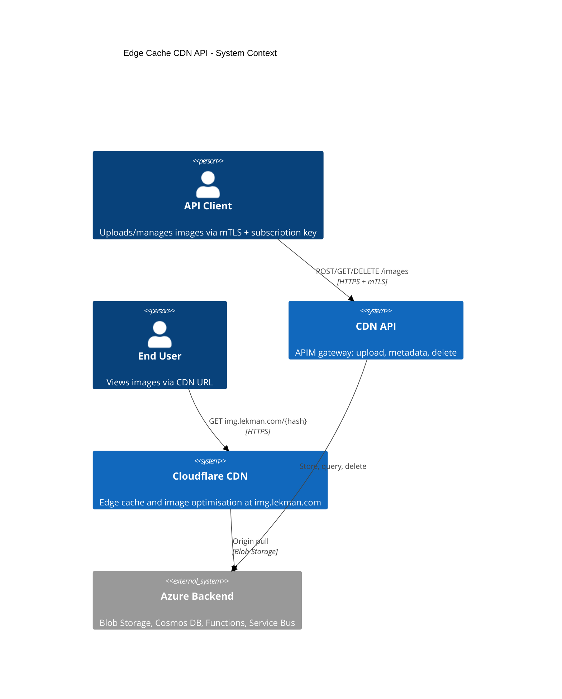
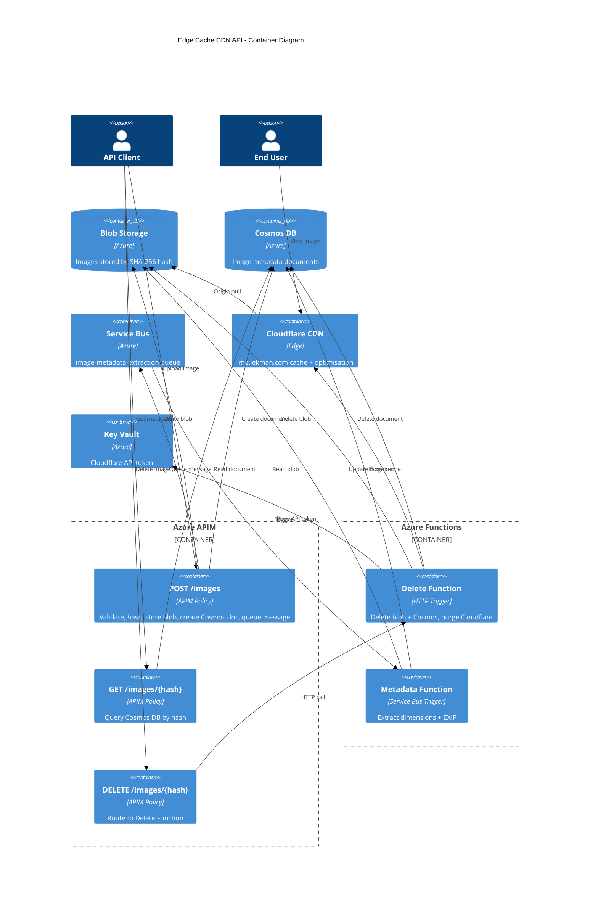

# Architecture

**Audience**: Developers and contributors working on @lekman/cdn.

## System Context (C4 Level 1)

The system context shows how the Edge Cache CDN API fits into a consumer's workflow. Clients upload images via APIM. Images are served from Cloudflare CDN at the edge.



## Container Diagram (C4 Level 2)



## Component Overview

| Component | Technology | Purpose |
|-----------|------------|---------|
| Azure APIM | API Management policies (XML) | Gateway: auth, validation, hash computation, direct backend calls |
| Azure Blob Storage | Hot tier, LRS, 7-day lifecycle | Immutable image store, keyed by SHA-256 hash |
| Azure Cosmos DB | NoSQL, serverless, 7-day TTL | Metadata store: dimensions, EXIF, status |
| Azure Service Bus | Basic tier, single queue | Async trigger for metadata extraction |
| Azure Functions | Consumption plan, TypeScript | Delete+purge (HTTP trigger), metadata extraction (Service Bus trigger) |
| Cloudflare CDN | img.lekman.com | Edge cache with Polish and WebP conversion |
| Azure Key Vault | Secrets | Cloudflare API token storage |

## Data Flow

### Upload Flow (POST /images)

```
Client → APIM
  1. Validate Content-Type (image/png, jpeg, gif, webp)
  2. Compute SHA-256 hash of body, encode as base64url (43 chars)
  3. Check Cosmos DB for existing document
     ├─ Exists → return existing document (201)
     └─ New →
          4. Write blob to storage at /{hash}
          5. Create Cosmos document (status: processing)
          6. Send message to Service Bus queue
          7. Return 201 with metadata document
```

### Retrieval Flow (GET /images/{hash})

```
Client → APIM
  1. Extract {hash} from URL path
  2. Query Cosmos DB by id (partition key = /id)
     ├─ Found → return 200 with document
     └─ Not found → return 404
```

### Delete Flow (DELETE /images/{hash})

```
Client → APIM → Delete Function
  1. Delete blob from storage (silent if not exists)
  2. Delete document from Cosmos (silent if not exists)
  3. Purge Cloudflare cache for img.lekman.com/{hash}
     ├─ Success → return 204
     └─ Failure → return 502 (storage already deleted)
```

### Image Delivery Flow

```
End User → img.lekman.com/{hash}
  → Cloudflare edge
    ├─ Cache hit → serve directly (< 50ms P95)
    └─ Cache miss → origin pull from Azure Blob Storage
       → cache for 7 days (immutable)
```

### Metadata Extraction Flow (Async)

```
Service Bus message → Metadata Function
  1. Read blob from storage
  2. Extract width, height from image headers
  3. Extract EXIF if present (DateTimeOriginal, GPS, Make/Model)
     ├─ Success → update Cosmos (status: ready, + metadata)
     └─ Failure → update Cosmos (status: failed), log error, no retry
```

## Hash Specification

| Property | Value |
|----------|-------|
| Algorithm | SHA-256 |
| Encoding | Base64url (RFC 4648), no padding |
| Length | 43 characters |
| Example | `LCa0a2j_xo_5m0U8HTBBNBNCLXBkg7-g-YpeiGJm564` |

Content-addressing provides automatic deduplication — uploading the same image twice returns the existing document. Cache invalidation is unnecessary because content at a given hash never changes.

## Cosmos DB Document Schema

```json
{
  "id": "{hash}",
  "url": "https://img.lekman.com/{hash}",
  "status": "processing|ready|failed",
  "size": 245678,
  "contentType": "image/jpeg",
  "width": 1920,
  "height": 1080,
  "exif": {
    "created": "2025-01-15T14:30:00Z",
    "location": { "lat": 51.5074, "lon": -0.1278 },
    "camera": "iPhone 15 Pro"
  },
  "createdAt": "2026-01-31T10:00:00Z",
  "ttl": 604800
}
```

## Technology Stack

| Component | Technology | Purpose |
|-----------|------------|---------|
| Runtime | Bun | TypeScript runtime for Azure Functions |
| Language | TypeScript (strict) | Type-safe source code |
| IaC | Bicep | Azure resource provisioning |
| Linting | Biome | Formatting and lint rules |
| Testing | Bun test runner | Unit tests with coverage |
| Pre-commit | Husky | Runs lint and typecheck before commit |
| Security | Semgrep | Static analysis in CI |
| CI/CD | GitHub Actions | Build, test pipeline |
| Versioning | release-please | Automated releases from conventional commits |
